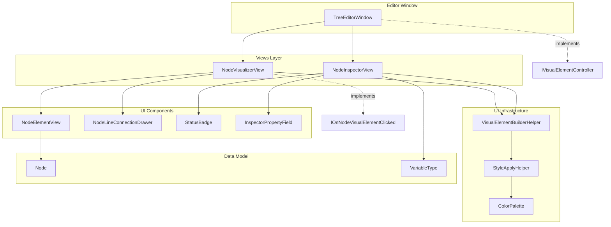
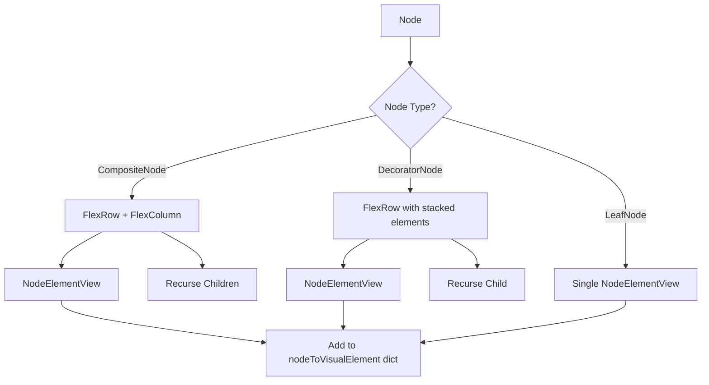

# ClosureBT Editor Views Architecture

This document provides an architectural overview of the ClosureBT Editor Views system for AI assistants and developers.

## Table of Contents
- [Overview](#overview)
- [Architecture Diagram](#architecture-diagram)
- [Core Components](#core-components)
- [UI Builder Pattern](#ui-builder-pattern)
- [File Map](#file-map)
- [Key Interfaces](#key-interfaces)
- [Styling System](#styling-system)
- [Rendering Pipeline](#rendering-pipeline)

---

## Overview

The Views folder contains **two primary view components** that form the visual representation of the behavior tree editor:

| Component | Purpose | Lines |
|-----------|---------|-------|
| `NodeInspectorView.cs` | Property inspector panel for selected nodes | 457 |
| `NodeVisualizerView.cs` | Graph visualization of the node tree structure | 112 |

Both views are Unity UI Toolkit (`VisualElement`) based and use the custom **E() Builder Pattern** defined in `UI/VisualElementBuilderHelper.cs`.

---

## Architecture Diagram



---

## Core Components

### NodeVisualizerView
**Location**: `Editor/Views/NodeVisualizerView.cs`

The graph canvas that displays the hierarchical node structure with connecting lines.

**Key Responsibilities:**
- Renders the recursive node tree using `NodeUI.DrawNodeRecursiveElement()`
- Manages node-to-visual-element mapping via `Dictionary<Node, VisualElement>`
- Draws connection lines between nodes using `NodeLineConnectionDrawer`
- Handles click events through `IOnNodeVisualElementClicked` interface

**Event Subscriptions:**
```csharp
NodeHistoryTracker.OnSnapshotIndexChanged += MarkDirtyRepaint;
_node.Editor.OnTreeStructureChanged += OnTreeStructureChanged;
_node.RootEditor.OnChildrenStatusChanged += OnNodeStatusChanged;
```

### NodeInspectorView
**Location**: `Editor/Views/NodeInspectorView.cs`

The property panel that displays the selected node's details and variables.

**Key Sections:**
1. **Header Section** - Node name, status badge
2. **Properties Section** - Variables list with `InspectorPropertyField`
3. **Hidden Variables Section** - Collapsible section for private variables

**Reactive Updates Pattern:**
```csharp
Scheduler.Execute(() => {
    var node = getNode();
    // Update UI based on node state
}).Every(0); // Every frame
```

---

## UI Builder Pattern

The codebase uses a **declarative, stack-based UI builder** defined in `UI/VisualElementBuilderHelper.cs`.

### E() Method Signature
```csharp
// Create new element with setup action
E<T>(Action<T> setup) where T : VisualElement, new()

// Wrap existing element with setup action  
E<T>(T element, Action<T> setup) where T : VisualElement
```

### How It Works
1. Creates/receives a `VisualElement`
2. Pushes it onto an internal stack
3. Executes the setup action (children added via nested E() calls)
4. Pops from stack and adds to parent

### Usage Example
```csharp
using static ClosureBT.UI.VisualElementBuilderHelper;

E<VisualElement>(container => {
    Style(new() {
        backgroundColor = ColorPalette.WindowBackground,
        padding = 12,
    });
    
    E<Label>(label => {
        label.text = "Title";
        Style(new() { fontSize = 14, color = ColorPalette.PrimaryText });
    });
    
    E<Button>(btn => {
        btn.text = "Click Me";
        btn.clicked += OnClick;
    });
});
```

---

## File Map

```
Editor/
├── Views/
│   ├── NodeInspectorView.cs      # Inspector panel (457 lines)
│   ├── NodeVisualizerView.cs     # Graph visualization (112 lines)
│   └── CLAUDE.md                 # This file
│
├── TreeEditorWindow.cs           # Main window controller (520 lines)
├── Node.Editor.UI.cs             # NodeElementView + NodeUI helper (295 lines)
├── NodeUIEditorInterfaces.cs     # IOnNodeVisualElementClicked, IVisualElementController
├── ColorPalette.cs               # Theme-aware color definitions (198 lines)
├── StatusBadge.cs                # Reusable status badge component
├── InspectorPropertyField.cs     # Property field for variables
├── ResizablePanel.cs             # Resizable panel wrapper
├── SnapshotIndexControllerElement.cs  # History navigation controls
└── NodeStackViewerElement.cs     # Stack-based node list view

UI/
├── VisualElementBuilderHelper.cs # E() builder + FlexRow/FlexColumn (159 lines)
├── StyleApplyHelper.cs           # Style() helper struct (143 lines)
├── UI_CONTEXT.md                 # API usage documentation
└── UI_STYLE_GUIDE.md             # Design patterns and conventions
```

---

## Key Interfaces

### IOnNodeVisualElementClicked
```csharp
public interface IOnNodeVisualElementClicked
{
    void OnNodeVisualElementClicked(Node node, ClickEvent e);
}
```
Implemented by `NodeVisualizerView` and `TreeEditorWindow`. Bubbles click events up the hierarchy.

### IVisualElementController
```csharp
public interface IVisualElementController : IOnNodeVisualElementClicked { }
```
Marker interface for the main window controller.

### Interface Discovery Pattern
Components find their controller using an extension method:
```csharp
var controller = this.GetInterface<IOnNodeVisualElementClicked>();
controller?.OnNodeVisualElementClicked(node, e);
```

---

## Styling System

### ColorPalette
All colors are centralized in `Editor/ColorPalette.cs` with **theme-aware properties**:

```csharp
public static Color PrimaryText => IsDarkMode
    ? new Color(0.9f, 0.9f, 0.9f, 1f)   // Light text for dark mode
    : new Color(0.1f, 0.1f, 0.1f, 1f);  // Dark text for light mode
```

**Key Color Categories:**
- Background colors: `WindowBackground`, `HeaderBackground`, `AlternateBackground`
- Text colors: `PrimaryText`, `SecondaryText`, `TertiaryText`
- Status colors: `StatusSuccessColor`, `StatusFailureColor`, `StatusRunningColor`
- Border colors: `PrimaryBorder`, `SecondaryBorder`, `SubtleBorder`

### StyleApplyHelper
Convenience struct for inline styling with shorthand properties:

```csharp
Style(new() {
    borderWidth = 1,      // Sets all 4 borders
    borderRadius = 8,     // Sets all 4 corners
    padding = 12,         // Sets all 4 sides
    margin = 8,           // Sets all 4 sides
});
```

---

## Rendering Pipeline

### Node Tree Rendering
`NodeUI.DrawNodeRecursiveElement()` builds the visual tree:



### Line Connection Drawing
`NodeLineConnectionDrawer` handles connections between nodes:
- Uses `generateVisualContent` callback with `Painter2D`
- Draws Bezier curves between parent and child nodes
- Colors based on node status

---

## Conditional Compilation

All Editor UI code is wrapped in:
```csharp
#if UNITASK_INSTALLED
// ... editor code
#endif
```

This ensures the editor compiles only when UniTask is installed. See `UniTaskInstallerWindow.cs` for the installation flow.

---

## Related Documentation

- [UI_CONTEXT.md](../../UI/UI_CONTEXT.md) - Full API usage guide
- [UI_STYLE_GUIDE.md](../../UI/UI_STYLE_GUIDE.md) - Design patterns and conventions
